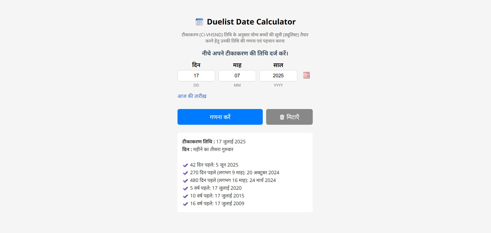

# 📆 Duelist Date Calculator

**Duelist Date Calculator** एक आसान और उपयोगकर्ता-अनुकूल टूल है जो सीआई-वीएचएसएनडी (Ci-VHSND) तिथि के आधार पर योग्य बच्चों की सूची तैयार करने में मदद करता है। यह टूल उपयोगकर्ताओं को केवल टीकाकरण की तिथि दर्ज कर के पिछले 6 सप्ताह (42 दिन), 9, 16 माह और 5, 10, 16 वर्ष पूर्व की तिथियाँ हिन्दी में दिखाता है।

## 🌟 Highlights

- 🗓 टीकाकरण तिथि के अनुसार ड्यूलिस्ट (Duelist) गणना
- 🔠 पूर्ण रूप से हिंदी UI और फॉर्म लेबल
- 🔁 इनपुट वैलिडेशन, शेक एनिमेशन, और एंटर/टैब पर नेविगेशन
- 📆 jQuery UI Datepicker के साथ कैलेंडर चयन
- ⏱ लाइव रिज़ल्ट्स और ऑटो फॉर्मेटिंग
- 🔧 आधुनिक और उत्तरदायी (responsive) डिजाइन

## 📦 लाइव डेमो

> आप इस टूल को [यहाँ लाइव](https://sudheerfy.github.io/Duelist-Date-Calculator) देख सकते हैं।

## 🚀 Features

- Hindi month and weekday name rendering
- Auto-focus and field transitions
- Input validations with error hints
- Calculation of:
  - 42 days/ 6 weeks ago
  - 9 months ago
  - 16 months ago
  - 5 years ago
  - 10 years ago
  - 16 years ago
- Weekday position within month (e.g., "महीने का दूसरा गुरुवार")

## 📁 Folder Structure
```bash
/duelist-date-calculator
│
├── index.html # Main HTML file
├── README.md # Project overview
└── assets/ # (Optional) Icons, images, etc.
```

## 🖼 Screenshot

 

## 🛠️ Technologies Used

- HTML5 / CSS3
- JavaScript (ES6+)
- jQuery & jQuery UI
- Google Fonts (Noto Sans, Noto Sans Devanagari)

## ✅ भविष्य के सुधार (Future Enhancements)

- CSV या Excel में डाउनलोड की सुविधा
- अन्य भाषाओं में सपोर्ट (जैसे इंग्लिश)
- एपीआई इंटीग्रेशन

## 🤝 योगदान (Contribute)

अगर आप इस प्रोजेक्ट में योगदान देना चाहते हैं, तो कृपया:

1. इस रेपो को फोर्क करें।
2. एक नया ब्रांच बनाएँ (`feature/your-feature-name`)।
3. बदलाव करें और कमिट करें।
4. PR (Pull Request) सबमिट करें।

## 📦 How to Use

1. Clone this repository:
   ```bash
   git clone https://github.com/sudheerfy/Duelist-Date-Calculator.git
   ```
   
## 📜 लाइसेंस

यह प्रोजेक्ट MIT लाइसेंस के अंतर्गत आता है — आप इसे स्वतंत्र रूप से उपयोग और संशोधित कर सकते हैं।

---

**निर्माता:** *सुधीर सिंह / Unicef Gavi Zero Dose Program Adra India*

यदि आपको यह टूल उपयोगी लगा, तो इसे स्टार ⭐ जरूर करें!   
